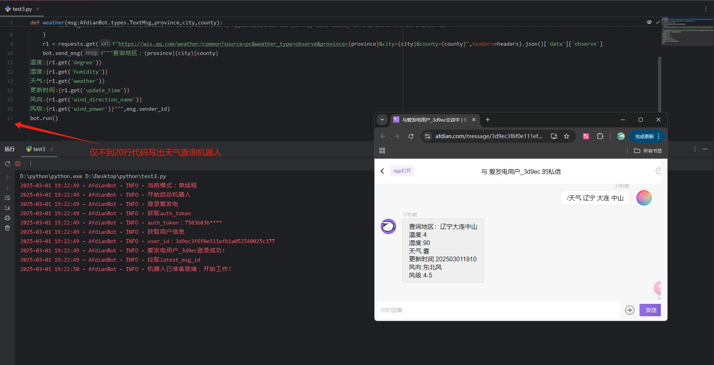

# AfdianBot-Core 使用文档

> 本文档将带领你认识AfdianBot-Core的每个东西，让你快速上手AfdianBot-Core，为你的爱发电接入机器人，增添灵活性与便利性  
> 使用场景：需要动态计算的激活码/密码等(想不出来其他的了XD)

特别感谢由missfoxw提供的[模板(点我前往)](https://github.com/missfoxw/docsify-template)  
以下为使用本库制作的简易天气查询机器人示例: 
本文档中的使用例子(包括下述例子)**部分**可以在[example](https://github.com/sun589/AfdianBot-Core/tree/main/examples)找到  

  

